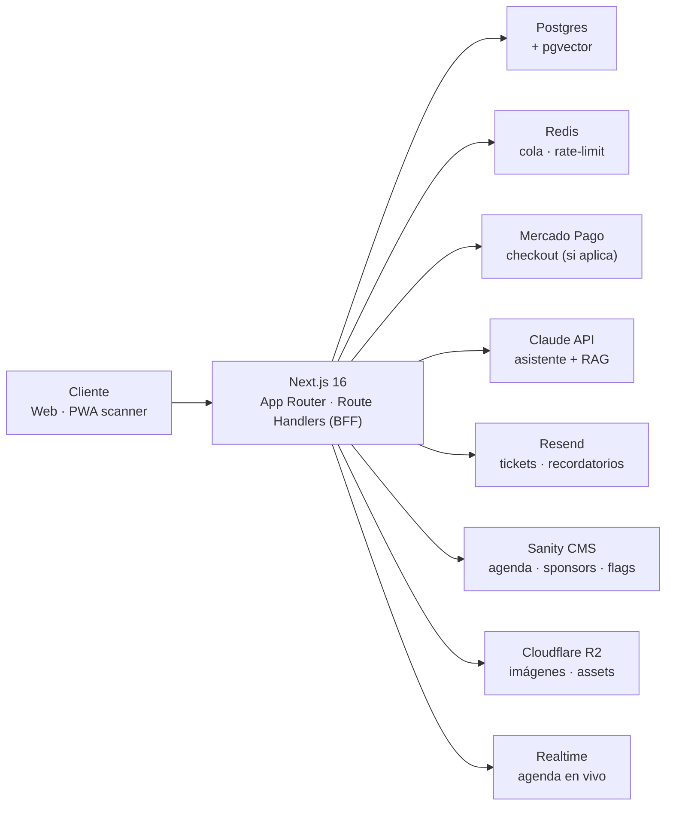

# Arquitectura de software — Sitio oficial ExpoJuy 2026

> Versión en Markdown para el repositorio (diffable, se actualiza vía PR). La versión diseñada para presentar está publicada en [este Artifact](https://claude.ai/code/artifact/38abc151-dbcc-4fe5-9861-d5aa012d651f) — mantener ambas en sync cuando cambie algo importante.

## Resumen ejecutivo

El sitio no es una landing informativa: vende/gestiona el acceso de visitantes, sostiene las rondas de negocios entre expositores y compradores internacionales (foco Corredor Bioceánico), y tiene que aguantar picos de tráfico en la apertura de inscripciones y en los 4 días del evento (9–12 de octubre de 2026).

Principios no negociables:
- Cada módulo se prende o apaga sin deploy.
- Ningún proveedor externo queda escrito a mano en la lógica de negocio.
- Ningún módulo queda acoplado a otro por fuera de una interfaz pública explícita.
- Un solo contenido, publicado en 5 idiomas.

## Arquitectura general



Todo lo que no es lógica propia del evento se delega a un servicio administrado. El BFF de Next.js es la única pieza que el equipo escribe y mantiene de punta a punta.

## Stack por capa

| Capa | Tecnología | Por qué |
|---|---|---|
| Frontend | Next.js 16, React 19, Tailwind, shadcn/ui | RSC para SEO/performance; componentes de checkout/formularios ya resueltos |
| Backend/API | Route Handlers | Mismo runtime que el frontend |
| Base de datos | PostgreSQL + Drizzle ORM | Relacional por naturaleza; tipado extremo a extremo |
| Plataforma de datos | Supabase | Postgres+Auth+Storage+Realtime+pgvector en un proveedor |
| Cache/colas | Upstash Redis | Rate-limiting y colas simples |
| Pagos | Mercado Pago | Estándar en Argentina; PCI mínimo. Condicional a [ADR-0003](adr/0003-modo-de-acceso.md) |
| Asistente IA | Claude API + Vercel AI SDK + pgvector | RAG acotado al contenido real del sitio |
| CMS | Sanity | Edición de contenido y feature flags sin deploy |
| i18n | next-intl | Ruteo y mensajes de UI por idioma |
| Hosting | Vercel | Nativo con Next.js, preview por PR |
| DNS/CDN | Cloudflare | WAF y mitigación DDoS |
| Observabilidad | Sentry, Better Stack | Alertas en tiempo real durante el evento |
| Calidad de código | ESLint + eslint-plugin-boundaries + Zod | Límites entre módulos y validación de datos enforced en CI |

## Configurabilidad y modularidad

Ver [ADR-0002](adr/0002-configurabilidad-adaptadores.md). Resumen:

- **Feature flags** por módulo (`visitorAccess`, `exhibitorPortal`, `businessRounds`, `aiAssistant`, `interactiveMap`), editables desde Sanity, chequeadas server-side, con kill-switch por variable de entorno.
- **Puertos y adaptadores** para toda integración externa — tabla completa en la versión Artifact. El código de negocio importa la interfaz (`PaymentProvider`, `AIAssistant`, ...), nunca el SDK.
- **Módulos por feature**: cada capacidad de negocio vive en `/modules/<nombre>` con su propio `index.ts` como única puerta de entrada; una regla de lint impide importar un archivo interno de otro módulo.

```
/modules
  /visitor-access/   index.ts · actions.ts · ui/
  /exhibitors/
  /ai-assistant/
  /interactive-map/
/lib/ports/          <- interfaces (adaptadores)
/lib/config/         <- flags + env tipado
```

## Multiidioma

Español (base) · Inglés · Portugués · Chino mandarín · quinto idioma a confirmar (ver decisiones abiertas). Textos de UI en `next-intl`, contenido editorial localizado en Sanity, fallback a español si falta traducción, fechas/números con `Intl` nativo. El asistente de IA responde nativo en el idioma del visitante.

## Módulos funcionales

| Módulo | Flag | Nota clave |
|---|---|---|
| Landing + CMS | — (siempre activo) | Contenido editable sin deploy |
| Registro de acceso | `visitorAccess` | `ADMISSION_MODE: free \| paid` — ver ADR-0003 |
| Portal de expositores + rondas de negocios | `exhibitorPortal`, `businessRounds` | Empezar con matching por rubro/país antes que similitud semántica completa |
| Asistente con IA | `aiAssistant` | RAG acotado al contenido real; deriva a humano fuera de dominio |
| Mapa interactivo | `interactiveMap` | Estado de sesiones en vivo, no geolocalización indoor (fuera de alcance v1) |

## Seguridad y cumplimiento

- Datos de tarjeta nunca tocan el servidor propio (Mercado Pago Checkout Pro).
- Cumplimiento Ley 25.326 (datos personales) para visitantes y expositores.
- Rate limiting en registro de acceso y en el asistente de IA.
- Roles separados: administrador, expositor, visitante.

## Roadmap

| Fecha | Fase | Entregable |
|---|---|---|
| 31/08 – 08/09 | Fase 0 · Concurso | Mockup navegable + memoria descriptiva |
| 11/09 – 20/09 | Fase 1 · Base | Landing, CMS y diseño final |
| 20/09 – 27/09 | Fase 2 · Transaccional | Registro de acceso y portal de expositores |
| 27/09 – 30/09 | Fase 3 · Entrega | Asistente IA, mapa, hardening y entrega |

## Decisiones abiertas

Ver [`docs/adr/`](adr) para las ya resueltas. Pendientes:

- ¿`main` cloud stack administrado (Vercel/Supabase) o infraestructura propia? → Resuelto en [ADR-0001](adr/0001-stack-base.md), a favor del primero.
- ¿Modo de acceso gratuito o pago? → [ADR-0003](adr/0003-modo-de-acceso.md), pendiente de confirmación externa.
- ¿Cuál es el quinto idioma (francés vs. una opción más regional)?
- ¿Sanity o un CMS self-hosted (Payload) por soberanía de datos del organismo público?
